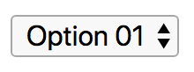
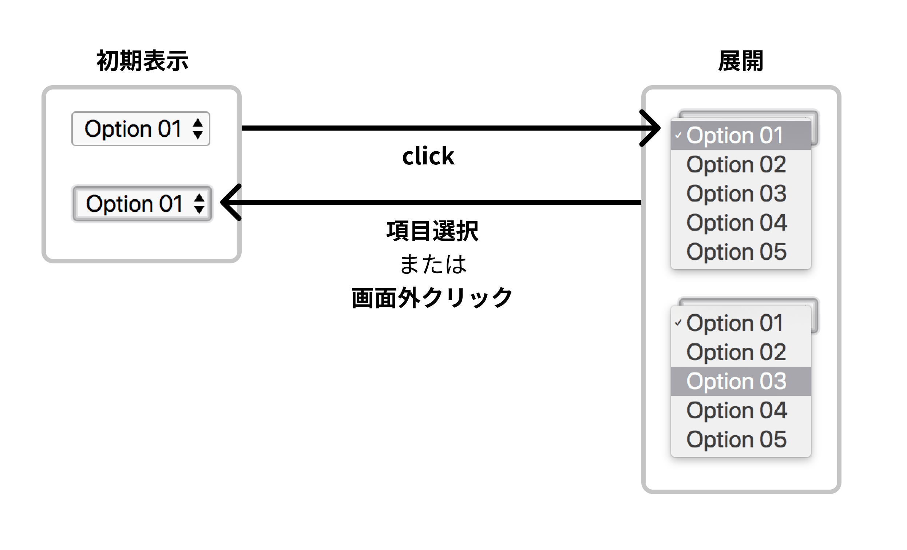
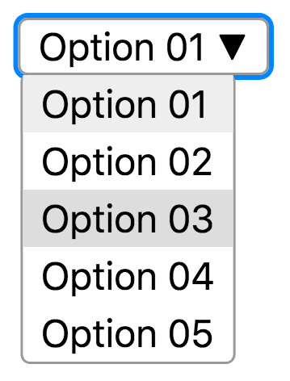
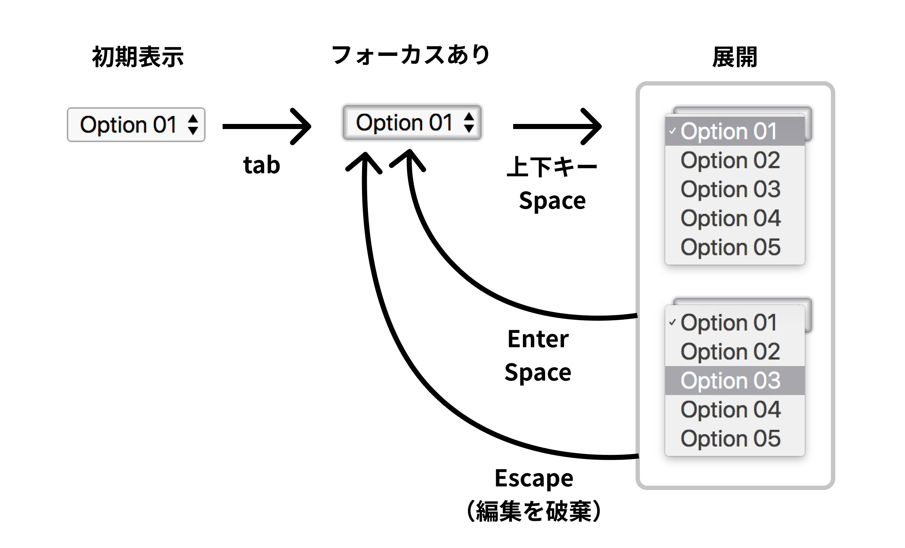

# フルスクラッチ GUI 入門

今回は `Vue.js v2.6.11` を利用してセレクト要素を自作します。

# 前提

- HTML / CSS / JS / Vue.js に関しては概要説明のみとします。
- アクセシビリティへの考慮はキーボード操作のみとします。

# 車輪の再発明という大罪

プログラミングの原理原則の一つに「車輪の再発明をするな」があります。

部品の再利用ができるのがプログラミングが発展してきた理由であるからです。

この本は、そういった原則を当たり前のように破ります。

真面目な方はこの本を閉じることをおすすめします。
この本は車輪の再発明のためのガイドであり、昏倒するに違いありません。

# フルスクラッチ GUI の原罪

さて、フルスクラッチ GUI を作るにあたって、一つ注意点があります。

おそらく、あなたはブラウザネイティブの form 要素を再実装することになるでしょう。
それを実装した瞬間に、アクセシビリティは間違いなく大きく損なわれます。

キーボード操作が可能ですか？
tab でフォーカスできますか？
フォーカス時のアウトラインが表示されますか？
ESC でキャンセルできますか？
音声読み上げでは「ボタン」要素であることが明示されますが、div でボタン風の見た目をこしらえても、
要素についての情報は失われてしまいます。

ボタンは button 要素で実装するのが基本です。
div 要素でも svg でもありません。

しかし、ここから先は当然のようにアクセシビリティが損なわれる世界です。
場合によっては、スクラッチではどうしてもネイティブのアクセシビリティに至らないことがあります。

# 作ってみようよ

ここから実装を試みていきますが、実力に自信のある方はまず、ここから先を読まないことをおすすめします。

というのも、自分のやり方、アイデアで実装してみたくないですか？
あくまでここから先は、筆者 hashrock の実装の一案に過ぎません。

React でも Vue でも Angular でも構いません。まずは自分で実装を試みて、
それからここから先を読んだほうが 10 倍楽しめることでしょう。
自分のアイデアをブラウザというキャンバスで試してみませんか？
その情熱こそが、複雑 GUI が人を引きつける第一のポイントです。

# select 要素を自作してみよう

## トレースもとを観察しよう

まず、トレースもとのUIを配置します。

```html
<select>
  <option>Option 01</option>
  <option>Option 02</option>
  <option>Option 03</option>
  <option>Option 04</option>
  <option>Option 05</option>
</select>
```

これをレンダリングすると下記の図のようになります。



一通り操作を行い、どんな遷移があるか洗い出しましょう。

遷移を図示すると下記のようになります。



現時点ではキーボード操作による遷移は考えません。

## モックしよう

開発順序は人によるかとは思いますが、私は書きながら設計を考えたいので、まずモックを選択します。
一番難しそうな状況の View を先に作ってしまいます。

まずは細かい挙動はおいておいて、開いた状態のコンポーネントをモックします。

v-if などで非表示にすることでこれらの挙動を再現できます。

今回の肝はフロートする options で、`position: absolute`が必要になりそうです。



DOM構造は下記の通りとしました。

この時点でtabindexをつけておきましょう。

```html
<div class="select" tabindex="0">
  <div class="label">Option 01 ▼</div>
  <div class="options">
    <div class="option">Option 01</div>
    <div class="option">Option 02</div>
    <!-- 選択状態にある要素にselectedクラスをつけておく -->
    <div class="option selected">Option 03</div>
    <div class="option">Option 04</div>
    <div class="option">Option 05</div>
  </div>
</div>
```

CSSは下記のようになります。各プロパティについてはコメントで解説します。

要素にフォーカスした際のアウトラインは、デフォルトだとポップアップも含む要素全体にかかってしまうため、今回は`outline: 0px;`で外した上で、代替アウトラインを付け直しています。

```css
.select {
  /* absoluteの基準地点 */
  position: relative;
  /* 見た目関連 */
  border: 1px solid #999;
  padding: 0.25em 0.5em;
  line-height: 0.9em;
  border-radius: 4px;
  cursor: default;
  /* アウトラインは消去（必ず代替アウトラインを設定すること） */
  outline: 0px;
}
.select:focus {
  /* 代替アウトライン */
  box-shadow: 0 0 0px 2px dodgerblue;
}
.options {
  /* 絶対配置 */
  position: absolute;
  /* 親要素の高さ分縦方向に移動 */
  top: 100%;
  left: 0;
  background: white;
  border: 1px solid #999;
  white-space: nowrap;
  border-radius: 4px;
}
.option {
  line-height: 1.5em;
  padding: 0 0.5em;
  cursor: default;
}
.option:hover {
  background: #eee;
}
.selected {
  background: #ddd;
}
```

見た目が完成したら、実データを表示できるようにしたり、クリック時などの挙動を組み込んで行きます。

## オープン・クローズの挙動をつけよう

select をクリックすることでトグルするようにしましょう。

## 実データをpropsとして受け取る

## v-modelに対応する

## キーボード操作に対応しよう

アクセシビリティの確保において、キーボード操作への対応は重要です。
併せて、フォーカス時の挙動についても再確認しておきましょう。



まず最初に tabindex をつけるところからです。

## 改善が必要な点

今回は扱いませんでしたが、コンポーネントの下にいつも余裕があるとは限らないので、ポップアップする要素は上下に出し分けられると良いでしょう。


## WAI-ARIA について

今回、時間的な余裕がなく、WAI-ARIA にきちんと対応したコンポーネントを紹介することができませんでした。
理想を言えばスクリーンリーダーに完全対応したコンポーネントを作りたかったところですが、
そのようなコンポーネントは、そもそもの select 要素をそのまま使うだけで良いです。

無駄に自作しない、というのも大事になってくるでしょう。
といいつつ、１章まるごと無駄に自作してしまいました。

しっかりしたコンポーネントを作りたい場合は、下記のサンプル実装を参考にしてください。

https://w3c.github.io/aria-practices/examples/listbox/listbox-collapsible.html

