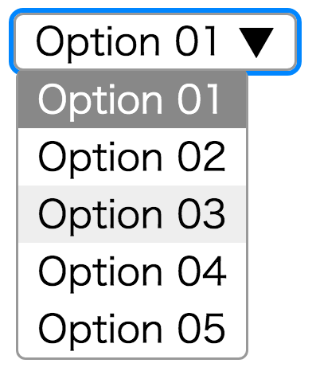
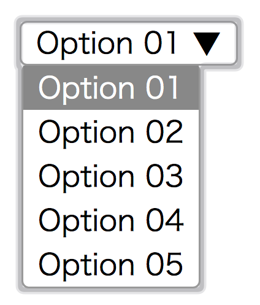

# フルスクラッチ GUI 入門

さて、いきなり自分で考えた GUI をスクラッチし始めるのもエキサイティングですが、
何を作ればいいか思いつかないという方も多いかと思います。
そこで、第一歩として「既存 UI の再実装」をしてみましょう。

今回は `Vue.js v2.6.11` を利用して select 要素を自作します。

## 前提

- HTML / CSS / JS / Vue.js に関しては概要説明のみとします。
- アクセシビリティへの考慮はキーボード操作のみとします。

## フルスクラッチ GUI の原罪

さて、フルスクラッチ GUI を作るにあたって、一つ注意点があります。

本稿では、ブラウザネイティブの form 要素を再実装することになるでしょう。
しかし再実装した瞬間にアクセシビリティは大きく損なわれます。

- キーボード操作が可能ですか？
- tab でフォーカスできますか？
- フォーカス時のアウトラインが表示されますか？

また、適切な要素を使わないことは、文書がセマンティックでなくなるという欠点があります。
例えば button 要素はスクリーンリーダーでは「ボタン」と読み上げられます。
いくら div でボタンに見た目を似せても、スクリーンリーダーにとってはただの文字列です。

これらの問題を適切に解決するためには、適切な要素を選択する以外にありません。

ここから先は当然のようにアクセシビリティが損なわれる世界です。
スクラッチではどうしてもネイティブのアクセシビリティに至らないことも多くあります。

## 作ってみようよ

ここから実装を試みていきますが、実力に自信のある方はまず、ここから先を読まないことをおすすめします。

というのも、自分のやり方、アイデアで実装してみたくないですか？
あくまでここから先は、筆者 hashrock の実装の一案に過ぎません。

React でも Vue でも Angular でも構いません。まずは自分で実装を試みて、
それからここから先を読んだほうが 10 倍楽しめることでしょう。
自分のアイデアをブラウザというキャンバスで試してみませんか？
その情熱こそが、複雑 GUI が人を引きつける第一のポイントです。

## select 要素を自作してみよう

### トレースもとを観察しよう

まず、トレースもとの UI を配置します。

```html
<select>
  <option>Option 01</option>
  <option>Option 02</option>
  <option>Option 03</option>
  <option>Option 04</option>
  <option>Option 05</option>
</select>
```

これをレンダリングすると下記の図のようになります。


一通り操作を行い、どんな遷移があるか洗い出しましょう。

遷移を図示すると下記のようになります。


現時点ではキーボード操作による遷移は考えません。

### モックしよう

開発順序は人によるかとは思いますが、私は書きながら設計を考えたいので、まずモックを選択します。
一番難しそうな状況の View を先に作ってしまいます。

まずは細かい挙動はおいておいて、開いた状態のコンポーネントをモックします。

v-if などで非表示にすることでこれらの挙動を再現できます。

今回の肝はフロートする options で、`position: absolute`が必要になりそうです。



DOM 構造は下記の通りとしました。

この時点で tabindex をつけておきましょう。

```html
<div class="select" tabindex="0">
  <div class="label">Option 01 ▼</div>
  <ul class="options">
    <!-- 選択状態にある要素にselectedクラスをつけておく -->
    <li class="option selected">Option 01</li>
    <li class="option">Option 02</li>
    <li class="option">Option 03</li>
    <li class="option">Option 04</li>
    <li class="option">Option 05</li>
  </ul>
</div>
```

Option は div でも表現可能ですが、リストであることを考えると ul / li 要素を使うほうが適切でしょう。

フォーカス時のアウトラインは、デフォルトだとポップアップも含む要素全体にかかってしまいます。



今回は`outline: 0px;`でアウトラインを非表示にしますが、フォーカス時の視覚的ヒントがないとアクセシビリティ上の問題がありますので、必ず代替アウトラインを付け直してください。

CSS は下記のようになります。各プロパティについてはコメントで解説します。

```css
.select {
  /* absoluteの基準地点 */
  position: relative;
  /* 見た目関連 */
  border: 1px solid #999;
  padding: 0.25em 0.5em;
  line-height: 0.9em;
  border-radius: 4px;
  cursor: default;
  /* アウトラインは消去（必ず代替アウトラインを設定すること） */
  outline: 0px;
}
.select:focus {
  /* 代替アウトライン */
  box-shadow: 0 0 0px 2px dodgerblue;
}
.options {
  /* 絶対配置 */
  position: absolute;
  /* 親要素の高さ分縦方向に移動 */
  top: 100%;
  left: 0;
  background: white;
  border: 1px solid #999;
  white-space: nowrap;
  border-radius: 4px;
  list-style: none;
  margin: 0;
  padding: 0;
}
.option {
  line-height: 1.5em;
  padding: 0 0.5em;
  cursor: default;
}
.option:hover {
  background: #eee;
}
.option.selected {
  background: #888;
  color: white;
}
```

見た目が完成したら、実データを表示できるようにしたり、クリック時などの挙動を組み込んで行きます。

### オープン・クローズの挙動をつけよう

select をクリックすることでトグルするようにしましょう。

Vue.js の場合、単純に open というフラグを持たせてしまえば OK です。クリックすると開き、フォーカスが外れる（blur）と閉じるようにしましょう。

```html
<div class="select" @mousedown="open = true" @blur="open = false" tabindex="0">
  <div class="select__label">
    Option 01 ▼
  </div>
  <ul class="options" v-if="open">
    <li class="option selected">Option 01</li>
    <li class="option">Option 02</li>
    <li class="option">Option 03</li>
    <li class="option">Option 04</li>
    <li class="option">Option 05</li>
  </ul>
</div>
```

```js
export default {
  data() {
    return {
      open: false
    }
  }
}
```

### Props を渡せるようにしよう

MySelect を利用するコンポーネントが props 経由でデータを渡せるようにします。選択肢に相当する `options` と選択されたデータに相当する `value` を渡します。

```html
<my-select :options="options" :value="value"></my-select>
```

```js
data() {
  return {
    value: 'Option 01',
    options: [
      { value: 'Option 01' },
      { value: 'Option 02' },
      { value: 'Option 03' },
      { value: 'Option 04' },
      { value: 'Option 05' }
    ]
  }
}
```

次に、MySelect.vue から選択肢一つ分をコンポーネントとして切り出します。

MySelect.vue

```html
<ul class="options" v-if="open">
  <my-option
    v-for="(option, idx) in options"
    :key="idx"
    @select="onSelect"
    :selected="selected === option"
    :option="option"
  ></my-option>
</ul>
```

MyOption.vue

```html
<template>
  <li @mousedown="select($event)" :class="{selected: selected}" class="option">
    {{option.value}}
  </li>
</template>

<script>
  export default {
    props: { selected: Boolean, option: Object },
    methods: {
      select() {
        this.$emit('select', this.option)
      }
    }
  }
</script>
```

### 要素を選択可能にする

何番目の要素が選択されているかを selectedIndex というデータに持たせます。また、MyOption から select イベントが来たときに selectedIndex を更新するロジックを組みます。

```js
export default {
  /* 中略 */
  data() {
    return {
      open: false,
      selectedIndex: -1,
      positionBottom: true
    }
  },
  computed: {
    selected() {
      return this.options[this.selectedIndex]
    }
  },
  methods: {
    setSelection(value) {
      this.selectedIndex = this.options.indexOf(value)
    },
    onSelect(value) {
      this.setSelection(value)
      this.open = false
    }
  },
  mounted() {
    this.selectedIndex = this.options.length > 0 ? 0 : -1
  }
}
```

### v-model に対応する

使いすぎは禁物ですが、Form 要素のような粒度の小さいコンポーネントにとっては v-model は手軽で便利です。

対応は簡単で、`value` Prop と `input` Event を備えることで v-model が利用できるようになります。

選択を確定したことを表す `apply` method を実装し、`input` Event を emit しましょう。

```js
methods: {
  /* 略 */
  apply() {
    if (this.open) {
      this.$emit('input', this.selected.value)
    }
  },
  onSelect(value) {
    this.setSelection(value)
    this.apply()
    this.open = false
  }
},
mounted() {
  this.selectedIndex = this.options.length > 0 ? 0 : -1
  this.apply()
}
```

### キーボード操作に対応しよう

アクセシビリティの確保において、キーボード操作への対応は重要です。
併せて、フォーカス時の挙動についても再確認しておきましょう。


実装していきます。tabindex でフォーカス可能な要素に `@keydown` を使うことでキー押下時に method を実行するようにしましょう。

```html
<div
  class="select"
  @mousedown="open = true"
  @blur="onBlur"
  @focus="onFocus"
  tabindex="0"
  @keydown.space.prevent="toggleOption"
  @keydown.up.prevent="moveSelect(-1)"
  @keydown.down.prevent="moveSelect(1)"
  @keydown.enter="closeOption(true)"
  @keydown.esc="closeOption(false)"
></div>
```

Space や矢印キー上下はブラウザデフォルト挙動でスクロールしてしまうことに留意しましょう。Vue.js の場合はキー指定のあとに `.prevent`を指定することで抑制できます。

```js
methods: {
  toggleOption() {
    this.apply()
    this.open = !this.open
  },
  moveSelect(offset) {
    this.open = true
    this.selectedIndex += offset
    this.clamp()
  },
  closeOption(apply) {
    if (apply) {
      this.apply()
    }
    this.open = false
  },
  clamp() {
    //selectedIndexの範囲制限
    this.selectedIndex = clamp(this.selectedIndex, 0, this.options.length - 1)
  },
  /* 略 */
},
```

### スクリーンリーダーへの配慮

今回は努力目標として、音声読み上げソフトウェアで自作 select 要素が正常に読み上げられること、という目標を立てていました。

時間的制約により、Windows Chrome と NVDA のみで検証を行いました。

スクリーンリーダには OS 組み込みのものも含め様々ありますので、この対策のみで十分とはとても言えません（というより、対策するのであれば普通にブラウザデフォルトの form を使うべきですね）。

WAI-ARIA では要素同士を関連付けるために ID 属性を多用します。一例としては combobox 相当の要素に必要になる `aria-activedescendant`ですが、選択中の option 相当の要素の ID を指定する必要があります。

もちろん HTML での ID 属性は document 内でユニークである必要があるため、複数コンポーネントが置かれた際には、ID がかぶらないように一工夫必要です。コンポーネントごとに ID へのプレフィックスを生成するなどの対応が考えられるでしょう。

ひとまず今回はそこまで考えず、渡すオプションに手書きで ID を追加します。

```
options: [
  { value: 'Option 01', id: 'Option01' },
  { value: 'Option 02', id: 'Option02' },
  { value: 'Option 03', id: 'Option03' },
  { value: 'Option 04', id: 'Option04' },
  { value: 'Option 05', id: 'Option05' }
]
```

MySelect.vue のテンプレート側では下記の対応を行います。

```html
<template>
  <div
    role="combobox"
    :aria-expanded="open ? 'true' : 'false'"
    aria-haspopup="listbox"
    :aria-activedescendant="selected ? selected.id : null"
  >
    <div class="select__label">
      {{value}}
      <span aria-hidden="true">▼</span>
    </div>
    <ul class="options" v-if="open" role="listbox">
      <my-option v-for="(option, idx) in options" ...></my-option>
    </ul>
  </div>
</template>
```

NVDA にとって特に重要だったのが role 属性です。role 属性を適切に設定しないとキーボード操作による option 選択が正常に動作しませんでした。

- `aria-expanded`はコンボボックスが展開されているかどうかを読み上げます。
- `aria-activedescendant`はどの option が選択中かを読み上げます。
- `aria-hidden`はスクリーンリーダにとって無意味な文字（この場合は下三角）を読み上げないようにします。

MyOption.vue には role と aria-selected、紐付け用の id 属性を追加します。

```html
<li :aria-selected="selected" role="option" :id="option.id">
  {{option.value}}
</li>
```

上記の設定をすることで、(1)閉じられているコンボボックスを選択 (2) スペースキーで展開 (3) 上下キーで Option を選択 の一連の動作は下記のように読み上げられます。

```
(1) Option01　コンボボックス　折りたたみ
(2) スペース　展開　リスト
(3) Option01　1の5
```

もちろん、NVDA 以外ではまた別の読み上げ結果になることでしょう。スクリーンリーダでの検証はあまりに大変で、正直ここで力尽きてしまいました。

アクセシビリティ対応自作 Select 要素をやりきる気概のある方は、W3C の aria-practices というリポジトリにサンプル実装がありますので、参考にしてみてください。

https://w3c.github.io/aria-practices/examples/listbox/listbox-collapsible.html

## 改善が必要な点

以上で自作 select 要素の実装をざっくり紹介しました。まだまだ機能が足りているとは言えません。

- Home / End キーに対応する必要があります。
- コンポーネントの下にいつも余裕があるとは限らないので、ポップアップする要素は上下に出し分ける必要があります。
- option が画面に収まりきらないほど長くなる場合はスクロールする必要があります。

上記もきっちりやるとなると、更に実装量は膨らむでしょう。

つくづく、デフォルトの select 要素は楽ですね。何も JS で実装する必要がないのですから…。アクセシビリティ対応なんてはじめから実装済みです。やはり、車輪の再実装はしないほうがいいですね。もうこりごりです。

しかし、やるなと言われるとやりたくなるのも人間のサガですよね。
